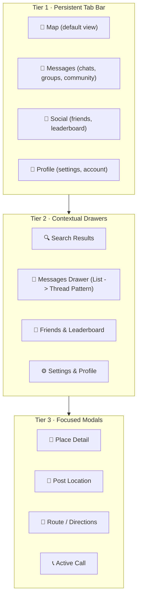
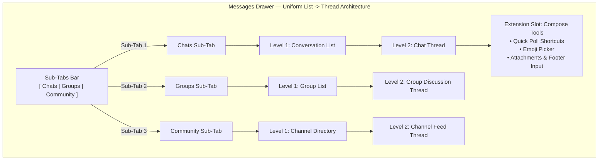
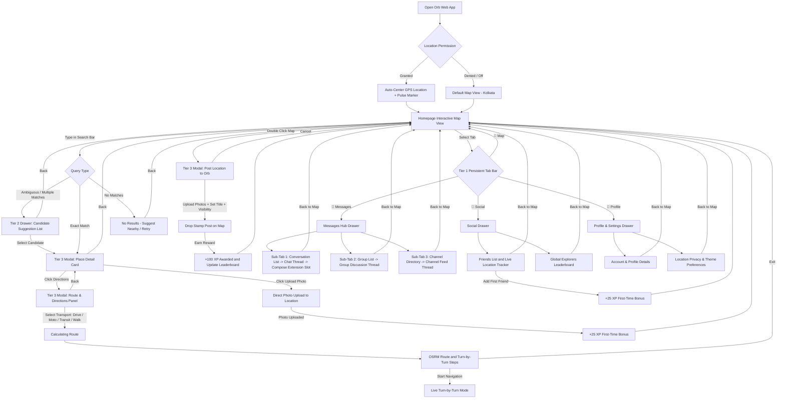

# 🏛️ Orb Application — 3-Tier Navigation Architecture & User Flow

```mermaid
flowchart TD
    subgraph Tier1 ["Tier 1 · Persistent Tab Bar"]
        T1_Map["📍 Map (default view)"]
        T1_Msg["💬 Messages (chats, groups, community)"]
        T1_Social["👥 Social (friends, leaderboard)"]
        T1_Prof["👤 Profile (settings, account)"]
    end

    subgraph Tier2 ["Tier 2 · Contextual Drawers"]
        T2_Search["🔍 Search Results"]
        T2_Msg["💬 Messages Drawer (List -> Thread Pattern)"]
        T2_Social["👥 Friends & Leaderboard"]
        T2_Set["⚙️ Settings & Profile"]
    end

    subgraph Tier3 ["Tier 3 · Focused Modals"]
        T3_Detail["🏢 Place Detail"]
        T3_Post["📌 Post Location"]
        T3_Nav["🧭 Route / Directions"]
        T3_Call["📞 Active Call"]
    end

    Tier1 --> Tier2
    Tier2 --> Tier3
```

---

## 💬 Messages Drawer Architecture (List → Thread Pattern)

```mermaid
flowchart TD
    subgraph MessagesDrawer ["Messages Drawer — Uniform List -> Thread Architecture"]
        SubTabs["Sub-Tabs Bar<br/>[ Chats | Groups | Community ]"]

        %% SUB-TAB 1: CHATS
        SubTabs -->|Sub-Tab 1| Chats["Chats Sub-Tab"]
        Chats --> ConvoList["Level 1: Conversation List"]
        ConvoList --> ChatThread["Level 2: Chat Thread"]
        ChatThread --> ExtensionSlot["Extension Slot: Compose Tools<br/>• Quick Poll Shortcuts<br/>• Emoji Picker<br/>• Attachments & Footer Input"]

        %% SUB-TAB 2: GROUPS
        SubTabs -->|Sub-Tab 2| Groups["Groups Sub-Tab"]
        Groups --> GroupList["Level 1: Group List"]
        GroupList --> GroupDisc["Level 2: Group Discussion Thread"]

        %% SUB-TAB 3: COMMUNITY
        SubTabs -->|Sub-Tab 3| Comm["Community Sub-Tab"]
        Comm --> Dir["Level 1: Channel Directory"]
        Dir --> Feed["Level 2: Channel Feed Thread"]
    end
```

---

## 🗺️ Comprehensive User Flow Diagram

```mermaid
flowchart TD
    A[Open Orb Web App] --> B{Location Permission}
    B -->|Granted| C[Auto-Center GPS Location + Pulse Marker]
    B -->|Denied / Off| D[Default Map View - Kolkata]

    C --> E[Homepage Interactive Map View]
    D --> E

    %% TIER 1 PERSISTENT TAB BAR
    E -->|Select Tab| T1{Tier 1 Persistent Tab Bar}
    T1 -->|📍 Map| E
    T1 -->|💬 Messages| Q[Messages Hub Drawer]
    T1 -->|👥 Social| S1[Social Drawer]
    T1 -->|👤 Profile| P1[Profile & Settings Drawer]

    %% SEARCH FLOW
    E -->|Type in Search Bar| F{Query Type}
    F -->|No Matches| F0[No Results - Suggest Nearby / Retry]
    F0 -->|Back| E
    F -->|Ambiguous / Multiple Matches| G[Tier 2 Drawer: Candidate Suggestion List]
    G -->|Select Candidate| H[Tier 3 Modal: Place Detail Card]
    G -->|Back| E
    F -->|Exact Match| H
    H -->|Back| E

    H -->|Click Directions| I[Tier 3 Modal: Route & Directions Panel]
    H -->|Click Upload Photo| J[Direct Photo Upload to Location]
    I -->|Back| H
    I -->|Select Transport: Drive / Moto / Transit / Walk| I2[Calculating Route]
    I2 --> K[OSRM Route and Turn-by-Turn Steps]
    K -->|Start Navigation| K1[Live Turn-by-Turn Mode]
    K -->|Exit| E

    J -->|Photo Uploaded| N1[+25 XP First-Time Bonus]

    %% MAP POSTING AND GAMIFICATION
    E -->|Double Click Map| L[Tier 3 Modal: Post Location to Orb]
    L -->|Cancel| E
    L -->|Upload Photos + Set Title + Visibility| M[Drop Stamp Post on Map]
    M -->|Earn Reward| N[+100 XP Awarded and Update Leaderboard]
    N --> E
    N1 --> E

    %% TIER 2 DRAWERS BREAKDOWN
    Q --> Q1[Sub-Tab 1: Conversation List -> Chat Thread -> Compose Extension Slot]
    Q --> Q2[Sub-Tab 2: Group List -> Group Discussion Thread]
    Q --> Q3[Sub-Tab 3: Channel Directory -> Channel Feed Thread]
    Q1 -->|Back to Map| E
    Q2 -->|Back to Map| E
    Q3 -->|Back to Map| E

    S1 --> S2[Friends List and Live Location Tracker]
    S1 --> S3[Global Explorers Leaderboard]
    S2 -->|Add First Friend| P1_Bonus[+25 XP First-Time Bonus]
    P1_Bonus --> E
    S2 -->|Back to Map| E
    S3 -->|Back to Map| E

    P1 --> P2[Account & Profile Details]
    P1 --> P3[Location Privacy & Theme Preferences]
    P2 -->|Back to Map| E
    P3 -->|Back to Map| E
```
